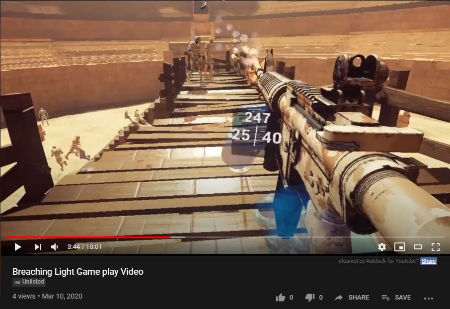
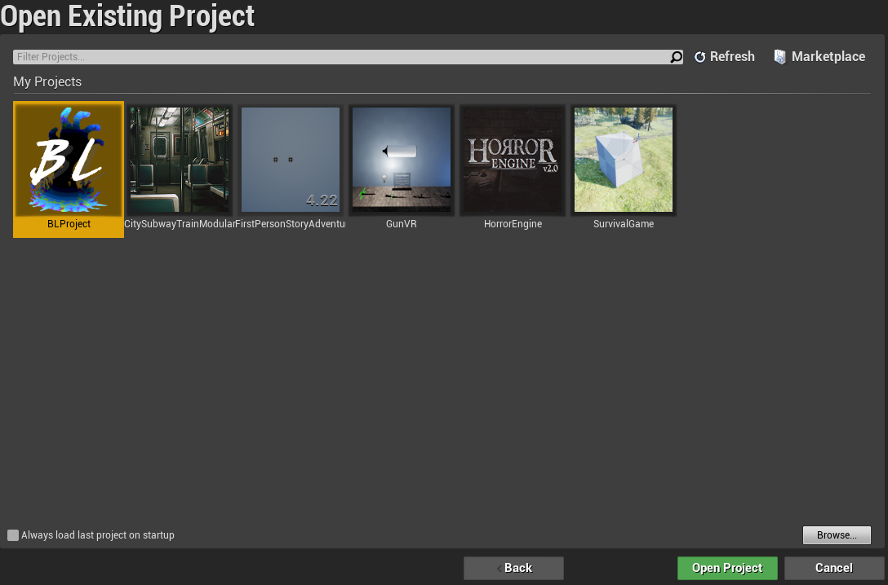
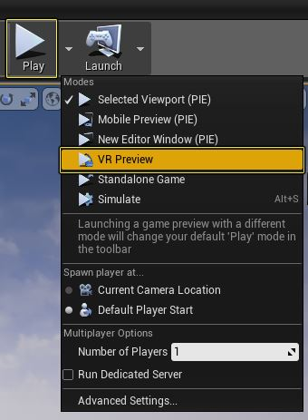

# **Virtual Reality Project By Nathaniel Robson**
[Prerequisites](#prerequisites)  
[Installing](#installing)  
[Controller Mappings](#controller-mappings)  
[Section 1](#section-1-character-setup)  
[Section 2](#section-2-weapons-flashlight-damage-and-player-death)  
[Section 3](#section-3-enemies-damage-and-ai)  
[Section 4](#section-4-score-kills-and-gamemode)  
[Section 5](#section-5-maps)  
[Section 6](#section-6-game-balancing-bug-fixes-future-implementations-and-review)
[Author](#author)  
[Project Supervisor](#project-supervisor)  
[Versioning Strategy](#versioning-strategy)  
[References](#references)
# Develop a VR Game In Unreal Engine 4: **_Breaching Light_**  
  
  Game files have not been uploaded due to filesize restrictions (Game Filesize: 7GB)
  
  
## **Abstract**
I have developed a Virtual Reality survival game, utilising the game development engine known as Unreal Engine 4. The name of my game is **_Breaching Light_** as it effectively portrays the in-game aesthetics, gameplay and style I have chosen. 
The player will fight off endless waves of enemies in multiple virtual environments, utilising tools, weapons and special items found to aid them in their survival. I focused on ensuring that each weapon and tool found is diverse and will offer the player a new way to play. Using guns, melee weapons, throwing weapons and much more, the player will attempt to claim a prestigious place on the leader board as each kill gets them that one step closer to a high score. The player can then use the score accumulated to purchase in-game weapons and tools from the item shop. I have added many features focused solely around virtual interaction to ensure that the player is fully immersed in their environment. I have designed and developed two playable levels, each with extremely diverse art styles, one of which is set in a dark and spooky forest at night where the player must rely on their flashlight and the tools found to survive. The other map I have developed is an ancient gladiator arena. The player has the choice of which they venture to first. In addition to these two maps, I have also developed a fully interactable main menu, which the player can virtually interact with and move around.
This project has given me great insight into what managing a project and developing a game entails, many aspects of which are overlooked by those that are not familiar with the subject. 
I have utilised in my game many aspects of Unreal Engine 4 such as graphical user interface, widget interaction, audio engineering, map design, performance optimisation, graphic design, post-processing, 3D modelling, texturing, animation and more to be further detailed in this report. 
  
## **Gameplay** - Press the image to be directed to a YouTube Video of Breaching Light Gameplay

  
### **Please note that all images can be clicked and zoomed in on to further read and understand the content, thank you.**  
  
## **Prerequisites**
To be able to run my project, the following prerequisites must be met:

* **Oculus Software Installed**
* **Windows 10 Installed**
* **Virtual Reality Headset (In this case, Oculus Rift S)**
* **Unreal Engine 4 Installed**
* **VR Ready, Discrete Graphics Card (Recommended Nvidia GTX 1060 6GB or Higher)**
* **DirectX 11 Installed**

## **Installing**
To install my project to your machine, please follow the steps below:

**Installing Oculus Software** - Please follow the tutorial provided by _Facebook Inc._, to install **Oculus**:  
[Oculus Software Install Guide](https://support.oculus.com/1829158827315721/)  
**Installing Unreal Engine 4** - Please follow the tutorial provided by _Epic Games Inc._, to install **Unreal Engine 4**:  
[Unreal Engine 4 Install Guide](https://docs.unrealengine.com/en-US/GettingStarted/Installation/index.html)  
  
Once you have successfully completed the steps above and have UE4 installed, proceed to download my repository.  
Find the unreal engine executable file on your machine and execute it. It is located inside the folder 'ce301_robson_n/BreachingLightGame/WindowsNoEditor' named '**BLProject.exe**'  
This will run the Windows executable file and start my game.  
  
**To run my game within the Unreal Engine 4 Editor:**  
Open Unreal Engine 4, you will then be presented with the '**Unreal Project Browser**'.  
  
  
  
  
Click the 'Browse' button in the bottom right corner of the project browser, and you will be presented with an explorer window in which you will have to locate the file '**BreachingLightGame.uproject**' which is located in this repository
in the folder '/ce301_robson_n/BreachingLightGame'.  
Select the **.uproject** file and press '**Open**'.  
You will now be presented with the project in the UE4 Editor. It is important that no files are modified before proceeding.  
Please select the drop-down icon next to the '**Play**' button and select '**VR Preview**'.  
  
  
  
  
This will execute the game, please place the Oculus Rift headset on and proceed to play the game!  

## **Controller Mappings**
Left Analogue Stick PRESS: **Teleport**  
Right Analogue Stick TURN: **Rotate Character Orientation**  
Left Lower Tigger: **Grab**  
Right Lower Trigger: **Grab**  
Left Upper Trigger: **Shoot**  
Right Upper Trigger: **Shoot**  
Y: **Drop Weapon**  
X: **Reset Weapon**  
B: **Teleport**  
A: **Reload**  

## **Section 1 - Character Setup**

This section describes how I set up the virtual reality Player Character and camera, character movement and object interaction.

* [View Section 1 Documentation](/documentation/Section_1.md)

## **Section 2 - Weapons, Flashlight, Damage and Player Death**
This section is split into two chapters; chapter 1 explains how I added the ability for the player character to use a weapons and chapter
two details the implementations of the players' flashlight, dealing damage and player death.

* [View Section 2-1 Documentation](/documentation/Section_2-1.md)
* [View Section 2-2 Documentation](/documentation/Section_2-2.md)

## **Section 3 - Enemies, Damage and AI**
This section describes how I implemented the enemies into my game using a BlackBoard, a Behaviour Tree and PawnSensing and following behavior. This section also covers how I implemented the enemy damaging the player using precise collision handling.

* [View View Section 3 Documentation](/documentation/Section_3.md)

## **Section 4 - Score, Kills and Gamemode**
This section covers how I added the ability to track score and kill count in-game. This section also covers the implementation of the gamemode.

* [View Section 4 Documentation](/documentation/Section_4.md)

## **Section 5 - Maps**  
This section describes the development of the maps in my game and an overview of each.  
  
  * [View Section 5 Documentation](/documentation/Section_5.md)

## **Section 6 - Game Balancing, Bug Fixes, Future Implementations and Review**
This section covers the balancing of the game, bug fixes and issues that persist and can be resolved in future iterations of the game and a review of the final product.

* [View Section 6 Documentation](/documentation/Section_6.md)

## **Author**
* **_Nathaniel Jarvis Robson_**

Contact: nr17076@essex.ac.uk

## **Project Supervisor**
*  **_Prof Riccardo Poli_**  
  

## **Versioning Strategy**
Iteratively updating my game in stages has enabled me to release different stages of my game over time.  
To do this, I used the software **GitHub Desktop**, which I linked to the CSEE GitLab server.

### **References**
* [Git Markdown Cheat Sheet](https://github.com/adam-p/markdown-here/wiki/Markdown-Cheatsheet)
